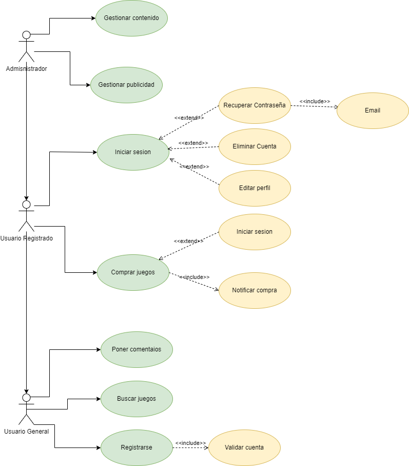
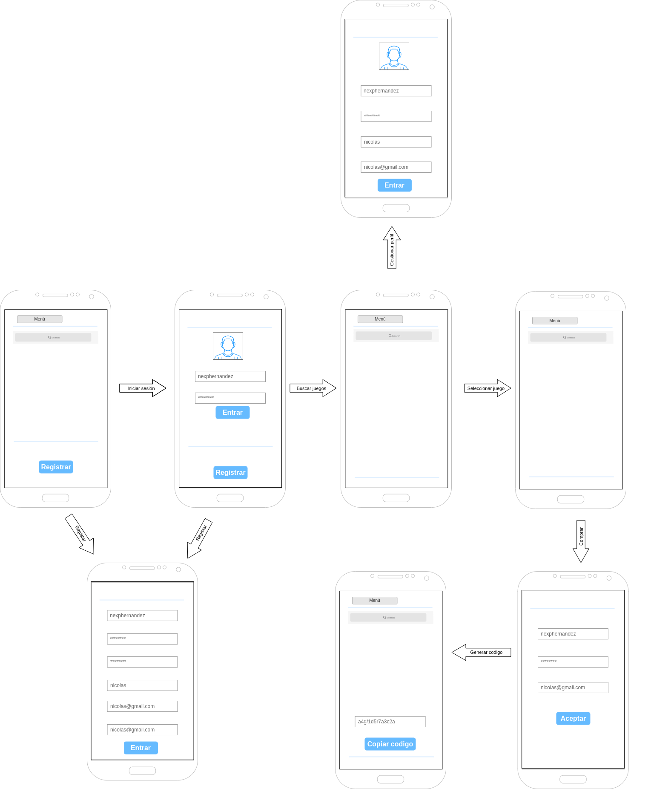

# Adict-Games  
Tienda de videojuegos donde podrás comprar la clave de tus juegos favoritos.

  
  
  

---

## Descripción  

Adict-Games es una tienda virtual diseñada para facilitar la compra de claves de videojuegos de manera rápida y segura.  
Esta aplicación está dirigida a gamers de todas las edades que buscan una experiencia de compra sencilla y confiable.  

### ¿Qué problema resuelve?  
Adict-Games elimina la necesidad de buscar claves de videojuegos en múltiples plataformas, centralizando las opciones en un solo lugar.  

### ¿Qué la hace única?  
- Interfaz intuitiva y amigable.  
- Soporte multilenguaje (Español e Inglés).  
- Gestión de cuentas y perfiles personalizados.  

---

## Diseño  

### Wireframe inicial  
  
*El diseño inicial se centró en la funcionalidad básica, como la búsqueda y compra de juegos.*  

### Diseño final implementado  
  
*El diseño final incluye mejoras en la navegación, un menú más intuitivo y soporte para múltiples idiomas.*  

---

## Tecnologías usadas  

- **JavaFX**: Para la interfaz gráfica.  
- **SQLite3**: Base de datos para almacenar usuarios, juegos y transacciones.  
- **Maven**: Gestión de dependencias y construcción del proyecto.  
- **ControlsFX**: Componentes adicionales para JavaFX.  
- **Jackson**: Manejo de datos en formato JSON.  

---

## Instrucciones de instalación  

1. Clona el repositorio:  
   ```bash
   git clone https://github.com/usuario/Adict-Games.git
   cd Adict-Games
   ```
2. Asegúrate de tener Maven instalado.

3. Ejecuta el siguiente comando para compilar y ejecutar el proyecto:
```bash
   mvn javafx:run
```
4. La aplicación se abrirá automáticamente en tu navegador.
---

## Características

| Característica       | Implementada |
|----------------------|--------------|
| Registro de usuarios | ✅            |
| Inicio de sesión     | ✅            |
| Búsqueda de juegos   | ✅            |
| Compra de claves     | ✅            |
| Multilenguaje        | ✅            |

---

## Roadmap  

- **Integración con pasarelas de pago**: Añadir soporte para PayPal y tarjetas de crédito.  
- **Sistema de comentarios**: Permitir a los usuarios dejar reseñas de los juegos.  
- **Notificaciones**: Alertas sobre ofertas y nuevos lanzamientos.  
- **Modo oscuro**: Mejorar la experiencia visual para sesiones nocturnas.  

---

¡Gracias por usar Adict-Games! 🎮  
