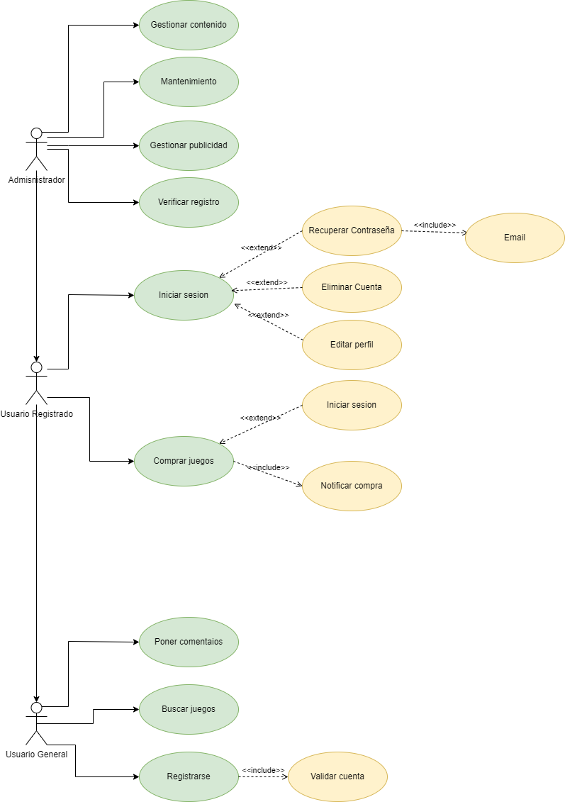

## Diagrama de casos de uso

## Especificación de Actores y Operaciones

### Actores

   #### Usuario general

|  Actor | Usuario General|
|---|---|
| Descripción  | Persona interesada en comprar o buscar un juego. |
| Características  ||
| Relaciones |  |
| Referencias | Registrarse, buscar juegos, poner comentarios|   
|  Notas ||
| Autor  | Nicolás Expósito Hernández |
|Fecha | 19/03/2025 |

   #### Usuario Resgistrado

|  Actor | Usuario General|
|---|---|
| Descripción  | Persona interesada en comprar o buscar un juego. |
| Características  ||
| Relaciones | Registrarse, buscar juegos, poner comentarios |
| Referencias | Iniciar sesion, comprar juegos.|   
|  Notas ||
| Autor  | Nicolás Expósito Hernández |
|Fecha | 19/03/2025 |

   #### Administrador

|  Actor | Administrador|
|---|---|
| Descripción  | Persona encargada de actualiza, agregar y eliminar juegos de la tienda. |
| Características  ||
| Relaciones | Registrarse, buscar juegos, poner comentarios, iniciar sesion, comprar juego. |
| Referencias | Gestionar contenido, gestionar publicidad.|   
|  Notas ||
| Autor  | Nicolás Expósito Hernández |
|Fecha | 19/03/2025 |

## Casos de usos

### Usuario General

#### Registrarse

|  Caso de Uso	CU.1 | Registrarse |
  |---|---|
  | Fuentes  | Este caso de uso se sustenta gracias al [documeto](). |
  | Actor  |  Usuario general,usuario registrado, Administrador |
  | Descripción | Registrarse en la tienda  |
  | Flujo básico ||
  | Pre-condiciones | |  
  | Post-condiciones  | Se genera un perfil |  
  |  Requerimientos | Correo electronico |
  |  Notas |  |
  | Autor  | nexphernandez |
  |Fecha | 19/03/2025 |

#### Buscar juegos

|  Caso de Uso	CU.2 | Buscar juegos |
  |---|---|
  | Fuentes  | Este caso de uso se sustenta gracias al [documeto](). |
  | Actor  |  Usuario general,Usuario registrado, Administrador |
  | Descripción | Buscar juegos en la app |
  | Flujo básico ||
  | Pre-condiciones | |  
  | Post-condiciones  | Encontrar juegos |  
  |  Requerimientos | |
  |  Notas |  |
  | Autor  | nexphernandez |
  |Fecha | 19/03/2025|

#### Poner comentarios

|  Caso de Uso	CU.3 | Poner comentarios |
  |---|---|
  | Fuentes  | Este caso de uso se sustenta gracias al [documeto](). |
  | Actor  |  Usuario general, Usuario registrado, Administrador |
  | Descripción | Ingresar comentarios en los juegos |
  | Flujo básico ||
  | Pre-condiciones | |  
  | Post-condiciones  | |  
  |  Requerimientos | |
  |  Notas |  |
  | Autor  | nexphernandez |
  |Fecha | 19/03/2025|

### Usuario Registrado

#### Gestionar perfil

|  Caso de Uso	CU.1 | Iniciar sesion |
  |---|---|
  | Fuentes  | Este caso de uso se sustenta gracias al [documeto](). |
  | Actor  |  Usuario registrado, Administrador |
  | Descripción | El usuario puede modificar su perfil |
  | Flujo básico ||
  | Pre-condiciones | |  
  | Post-condiciones  | |  
  |  Requerimientos | Tener cuenta |
  |  Notas |  |
  | Autor  | nexphernandez |
  |Fecha | 19/03/2025|

#### Comprar juegos

|  Caso de Uso	CU.2 | Comprar juegos |
  |---|---|
  | Fuentes  | Este caso de uso se sustenta gracias al [documeto](). |
  | Actor  |  Usuario registrado, Administrador |
  | Descripción | Comprar un juego de la alicación |
  | Flujo básico ||
  | Pre-condiciones | |  
  | Post-condiciones  | |  
  |  Requerimientos | Tener cuenta |
  |  Notas |  |
  | Autor  | nexphernandez |
  |Fecha | 19/03/2025|

### Administrador

#### Gestionar contenido

|  Caso de Uso	CU.1 | Gestionar contenido |
  |---|---|
  | Fuentes  | Este caso de uso se sustenta gracias al [documeto](). |
  | Actor  | Administrador |
  | Descripción | Gestiona que juegos tendrá la aplicación |
  | Flujo básico ||
  | Pre-condiciones | |  
  | Post-condiciones  | |  
  |  Requerimientos | Tener cuenta |
  |  Notas |  |
  | Autor  | nexphernandez |
  |Fecha | 19/03/2025|

#### Gestionar publicidad

|  Caso de Uso	CU.3 | Gestionar publicidad |
  |---|---|
  | Fuentes  | Este caso de uso se sustenta gracias al [documeto](). |
  | Actor  | Administrador |
  | Descripción | Se encarga de la publicidad que tendra la aplicacion ||
  | Pre-condiciones | |  
  | Post-condiciones  | |  
  |  Requerimientos | Tener cuenta |
  |  Notas |  |
  | Autor  | nexphernandez |
  |Fecha | 19/03/2025|
